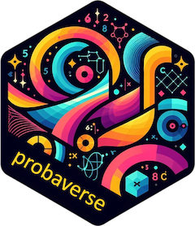

<!-- README.md is generated from README.Rmd. Please edit that file -->

```{r, include = FALSE}
knitr::opts_chunk$set(
  collapse = TRUE,
  comment = "#>",
  fig.path = "man/figures/README-",
  out.width = "100%"
)
```

# probaverse

<!-- badges: start -->
# probaverse 
[](https://github.com/probaverse/probaverse/actions/workflows/R-CMD-check.yaml)
[](https://app.codecov.io/gh/probaverse/probaverse)
[](https://lifecycle.r-lib.org/articles/stages.html#stable)
<!-- badges: end -->

The probaverse is a suite of packages that facilitate working with probability distributions. Since they all work in harmony and are better when loaded together, the `probaverse` package exists for loading these packages.

Loading `probaverse` is the best way to interact with the packages as many of the packages are under active development.

## Installation

The `probaverse` package is not on CRAN yet. You can install the development version of probaverse like so:

``` r
# install.packages("remotes") # Do you need to install `remotes`?
remotes::install_github("probaverse/probaverse")
```

## Example

`probaverse` will load:

- [`distionary`](https://distionary.probaverse.com): create and evaluate probability distributiuns.
- [`distplyr`](https://distplyr.probaverse.com): manipulate probability distributions.
- [`famish`](https://famish.probaverse.com): estimate probability distribution from data.
- `uscore` (being phased out for `gristmill`: data-based probability distributions).

Eventually, `couple` will be added to the mix, too, for building dependence models with copulas.

Load the probaverse packages like so.

```{r}
library(probaverse)
```

## Code of Conduct

Please note that the probaverse project is released with a [Code of Conduct](https://contributor-covenant.org/version/2/1/CODE_OF_CONDUCT.html). By contributing to this project, you agree to abide by its terms.
